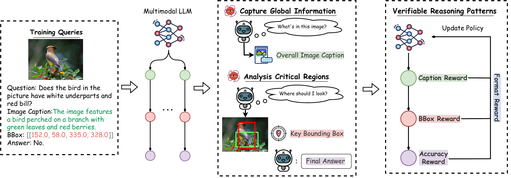

#  SATORI-R1: Incentivizing Multimodal Reasoning with Spatial Grounding and Verifiable Rewards

🔗 This is the **official implementation** of **SATORI**.



---

## 🛠️ Requirements

To install dependencies:

```bash
conda env create -f environment.yaml
````

We use [**ms-swift**](https://github.com/modelscope/ms-swift) to train the model. Install via:

```bash
pip install ms-swift -U
```

*or:*

```bash
git clone https://github.com/modelscope/ms-swift.git
cd ms-swift
pip install -e .
```

---

## 🎯 Training

Run the following command to start training:

```bash
MAX_PIXELS=401408 \
NPROC_PER_NODE=4 \
swift rlhf \
    --rlhf_type grpo \
    --model Qwen/Qwen2.5-VL-3B-Instruct \
    --external_plugins ./plugin.py \
    --reward_funcs external_format external_bbox_acc extern_vqa_acc external_caption_acc \
    --use_vllm false \
    --vllm_device auto \
    --vllm_gpu_memory_utilization 0.6 \
    --train_type full \
    --torch_dtype bfloat16 \
    --dataset <DATA_PATH> \
    --max_length 2048 \
    --max_completion_length 512 \
    --num_train_epochs 1 \
    --per_device_train_batch_size 4 \
    --per_device_eval_batch_size 4 \
    --learning_rate 1e-6 \
    --gradient_accumulation_steps 2 \
    --save_strategy 'steps' \
    --eval_strategy 'steps' \
    --eval_steps 200 \
    --save_steps 200 \
    --save_total_limit 2 \
    --logging_steps 1 \
    --output_dir output/GRPO \
    --warmup_ratio 0.01 \
    --dataloader_num_workers 4 \
    --num_generations 16 \
    --temperature 1.0 \
    --top_p 0.9 \
    --top_k 50 \
    --system './prompt.txt' \
    --deepspeed zero2 \
    --log_completions true \
    --vllm_max_model_len 1024 \
    --num_iterations 1 \
    --num_infer_workers 1 \
    --async_generate false \
    --beta 0.001 \
```

> **Note:**
>
> * `external_format` formats the data
> * `external_bbox_acc` computes bounding-box accuracy
> * `extern_vqa_acc` computes VQA accuracy
> * `external_caption_acc` computes caption accuracy
>   (See `plugin.py` for details) 🔍

---

## 📈 Evaluation

We provide an evaluation script in the `VLMEvalKit` directory. Make sure `VLMEvalKit` is in your working directory and update the dataset/model paths in `config.py`:

```text
# File: ./VLMEvalKit/vlmeval/config.py (line 417)
```

### 🏃‍♂️ Run Evaluation

```bash
cd VLMEvalKit
CUDA_VISIBLE_DEVICES=0,1,2,3 \
torchrun --nproc-per-node=4 run.py \
  --data MMBench MMStar \
  --model Qwen2.5-VL-3B-Instruct \
  --verbose
```

---

## 💾 Trained Models

Download here:

* 🔗 [SATORI-3B](https://huggingface.co/justairr/SATORI)

More model architechures and sizes will be released soon! 🔜

---

## 📚 Dataset: VQA-Verify

We release the **VQA-Verify** dataset here: [link](https://huggingface.co/datasets/justairr/VQA-Verify) 🚀

---

## Acknowledgements
This project adapts from [ms-swift](https://github.com/modelscope/ms-swift.git) and [VLMEvalKit](https://github.com/open-compass/VLMEvalKit.git). Thanks for their great work! 🙏

## 🤝 Contributing

We welcome your **issues**, **PRs**, and **feedback**!
Feel free to open an issue or submit a pull request. 🙌


